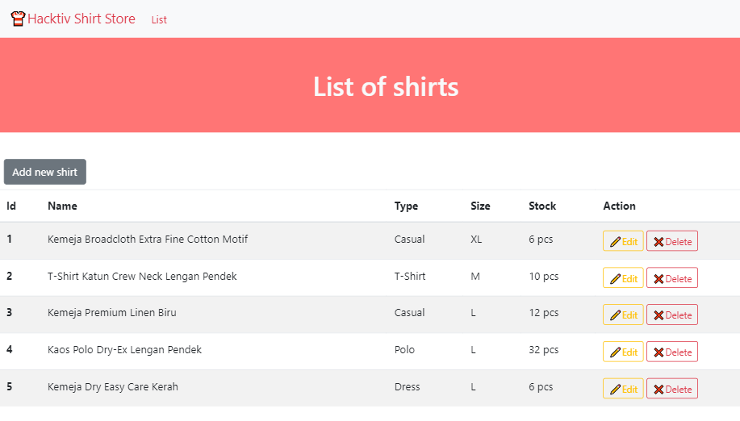
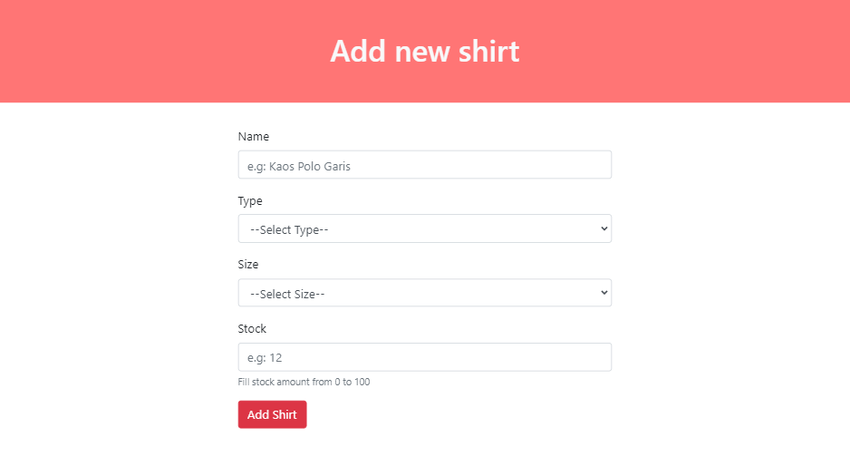
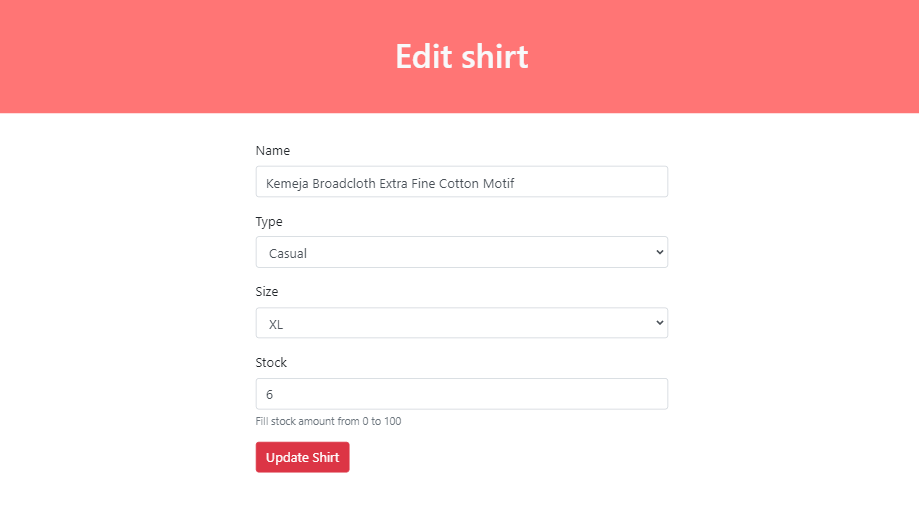
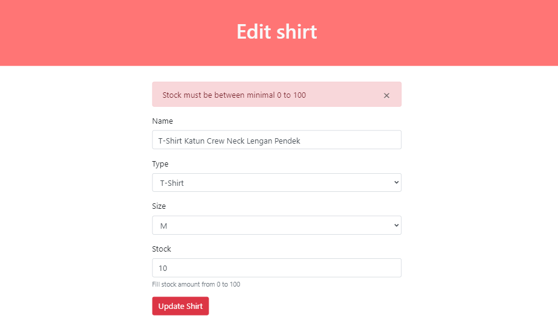
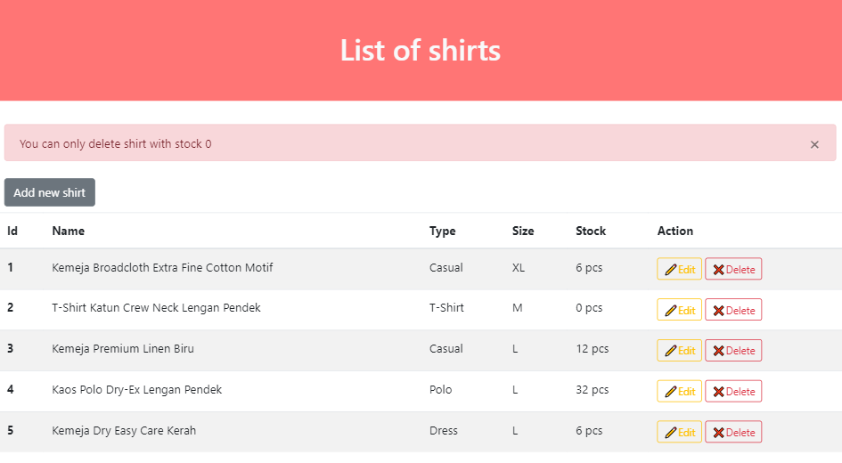

# 👕 Hacktiv Shirt Store

⏰ Time: 150 minutes

### Livecode Phase 1 Week 3

Sebuah toko baju meminta bantuan kamu untuk membuat aplikasi yang melakukan listing terhadap baju yang mereka jual.

[Link Demo](https://hacktiv-shirt-store.herokuapp.com/)

## Release 0 (5 points)
Buatlah *DATABASE* bernama `p1-livecode-w3` pada database PostgreSQL.
> Nama database wajib sesuai dengan requirement

## Release 1 (12 points)
Buatlah file `setup.js` yang berfungsi untuk membuat table `shirts` yang memiliki kolom-kolom sebagai berikut:

| Field         | Datatype | Modifiers   |
| ------------- | -------- | ----------- |
| id            | SERIAL   | PRIMARY KEY |
| name          | VARCHAR  | NOT NULL    |
| type          | VARCHAR  | NOT NULL    |
| size          | VARCHAR  | NOT NULL    |
| stock         | INTEGER  | NOT NULL    |

Jalankan file `setup.js` untuk membuat table `shirts` pada database `p1-livecode-w3`

## Release 2 (12 points)
Buatlah file `seed.js` yang berfungsi untuk melakukan seeding data ke dalam table `shirts` berdasarkan data dari `shirts.json`.

Jalankan file `seed.js` untuk melakukan seeding ke table `shirts` pada database.

## Release 3 (15 points)

Buatlah routing dengan menggunakan `ExpressJS` agar dapat melakukan *CRUD operations* dengan detail sebagai berikut:

| Method | Route              | Keterangan                                                                                                                      |
| ------ | -----------------  | ------------------------------------------------------------------------------------------------------------------------------- |
| GET    | /                  | Menampilkan semua baju yang ada di dalam table `shirts`                                                                         |
| GET    | /shirts/add        | Menampilkan halaman form untuk menambahkan data baju                                                                            |
| POST   | /shirts/add        | Menerima data yang dikirim dari halaman `/shirts/add` untuk melakukan _insertion_ ke dalam table `shirts`                       |
| GET    | /shirts/edit/:id   | Menampilkan halaman form untuk mengedit data baju berdasarkan `id` yang dikirimkan                                              |
| POST   | /shirts/edit/:id   | Menerima data yang dikirim dari halaman `/shirts/edit/:id` untuk melakukan _update_ data baju berdasarkan `id` yang dikirim     |
| GET    | /shirts/delete/:id | Melakukan _delete_ data baju berdasarkan `id` yang dikirimkan                                                                   |

> ***OPTIONAL:*** Kamu bisa menggunakan template pada file html di dalam folder `template` untuk membantu kamu  membuat tampilannya.

## Release 4 (22 points)
### Halaman Home atau Route `/`
Implementasikan routing `/` dengan membuat halaman `Home` dimana halaman ini menampilkan semua baju yang ada pada table `shirts` dalam bentuk list yang terdiri dari kolom **id**, **name**, **type**, **size**, **stock**, dan **action**.

Pada kolom action terdapat 2 link yaitu `edit` dan `delete` yang masing-masing akan mengarah ke `/shirts/edit/:id` dan `/shirts/delete/:id`.

### Halaman Add Shirt atau Route `/shirts/add`
Halaman add akan menampilkan form untuk memasukkan data baju yang akan disimpan ke dalam database.

Untuk bagian `type` menggunakan select input yang terdapat 4 pilihan:
  - Casual
  - Dress
  - T-Shirt
  - Polo

Untuk bagian `size` menggunakan select input yang terdapat 4 pilihan:
  - S
  - M
  - L
  - XL

Apabila berhasil menambahkan baju maka halaman akan berpindah ke home atau `/`

## Release 5 (22 points)

### Halaman Edit Shirt atau Route `/shirts/edit/:id`
Halaman edit akan menampilkan form yang berisikan data baju yang akan diedit.

Saat form ini terbuka, pastikan semua input dan select option sudah terisi sesuai dengan data baju yang akan diedit.

Apabila berhasil mengedit baju maka halaman akan berpindah ke home atau `/`

### Delete Shirt atau Route `/shirts/delete/:id`
Untuk mengimplementasikan routing ini, kamu tidak perlu membuat halaman baru, tapi cukup dengan menekan tombol delete yang akan mengarahkan routing ke `/shirts/delete/:id` dimana proses delete akan dilakukan berdasarkan `id` yang dikirimkan.

Apabila berhasil menghapus baju maka halaman akan berpindah ke home atau `/`

## Release 6 (12 points)
Buatlah validasi pada **server** untuk fitur `Add`, `Edit` dan `Delete`:

### Add dan Edit:
- `name` harus terdiri dari minimal 2 kata (*words*)
- `type` tidak boleh dikosongkan
- `size` tidak boleh dikosongkan
- `stock` harus terdiri dari number diantara 0 - 100

Jika kondisi diatas tidak terpenuhi maka data tidak akan bertambah/berubah dan tampilkan pesan error.

### Delete:
- Hanya baju yang memiliki `stock` **0** yang dapat dihapus

**NOTE**
Untuk pesan error bisa ditampilkan dengan menggunakan `res.send`. Pesan error bebas selama yang ditampilkan jelas dan sesuai dengan error yang terjadi.